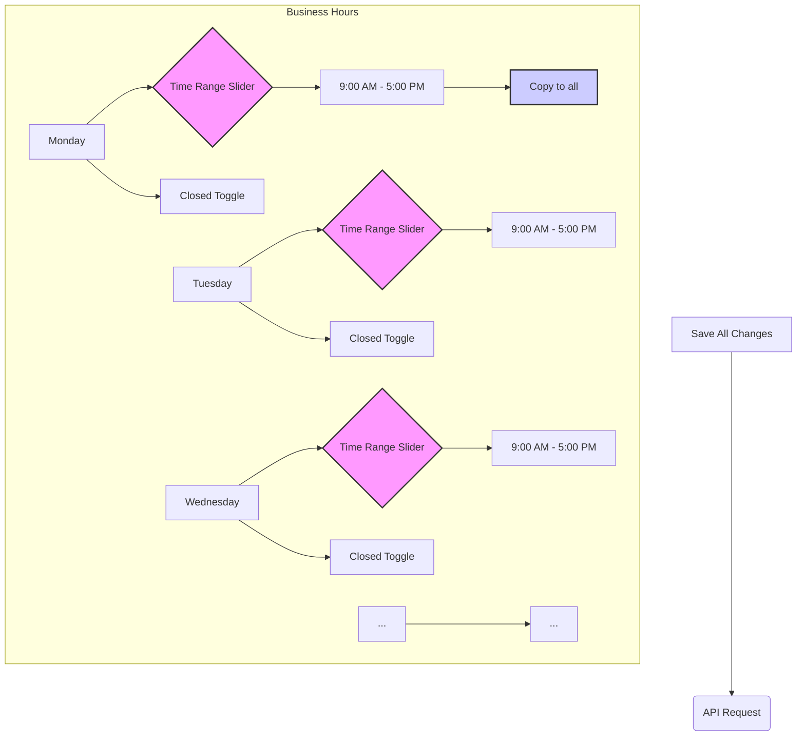

# Comprehensive Refactoring Guide: Business Settings

This guide provides a detailed plan for refactoring the business settings feature, including both backend and frontend changes.

## 1. Backend Changes

... (previous backend guide content remains unchanged) ...

## 2. Frontend UI/UX Enhancement Plan

To improve the user experience, the business hours selection will be redesigned.

### 2.1. Key UI Improvements
*   **Interactive Time Range Slider:** Replace the dropdowns with a more intuitive time range slider for each day.
*   **"Copy to All" Functionality:** Add a button to apply a single day's time settings to all other days.
*   **Visual Feedback:** The UI will provide clear visual cues for open hours, closed days, and the times selected.

### 2.2. UI Mockup Diagram (Mermaid)

## 3. Frontend Implementation

... (previous frontend implementation guide content remains, but will be updated to reflect the new UI) ...

This guide provides a clear path to refactoring your business settings feature. By following these steps, you will have a more robust and maintainable implementation with a significantly improved user experience.