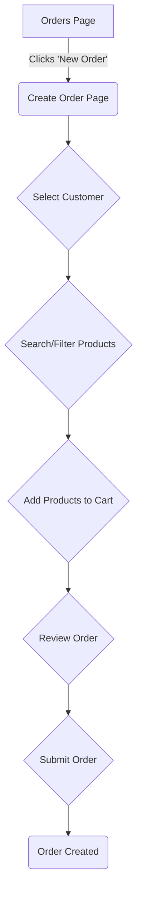

# New Order Page Design

This document outlines the design for the new order creation page. The goal is to create an intuitive and efficient user interface for creating new orders, incorporating robust product search, filtering, and a clear summary of the order details.

## 1. High-Level Workflow

The user clicks the "New Order" button, which navigates them to the `/orders/create` page. This page will be a single-page application experience to guide the user through creating an order.



## 2. Page Layout

The page will be divided into three main sections:
1.  **Customer Information:** A section to search for and select an existing customer or create a new one.
2.  **Product Selection:** The main area for finding and adding products to the order.
3.  **Order Summary (Cart):** A sidebar that displays the items added to the order, quantities, and the total price.

```
+-----------------------------------------------------------------+
|                      Create New Order                           |
+-----------------------------------------------------------------+
| Customer: [Search for customer...] [Create New]                 |
+-----------------------------------------------------------------+
|                               |                                 |
|      Product Selection        |          Order Summary          |
|                               |                                 |
|  +-------------------------+  |  +---------------------------+  |
|  | Search products...      |  |  | Cart Items                |  |
|  +-------------------------+  |  |                           |  |
|  |                         |  |  | Item 1 - Price            |  |
|  |   Filters (Categories)  |  |  | Item 2 - Price            |  |
|  |   [ ] Category 1        |  |  |                           |  |
|  |   [ ] Category 2        |  |  +---------------------------+  |
|  |                         |  |  | Total: $XX.XX             |  |
|  +-------------------------+  |  +---------------------------+  |
|                               |  | [Place Order]             |  |
|  Product List                 |  +---------------------------+  |
|  +-------------------------+  |                                 |
|  | Product 1 | Add to Cart |  |                                 |
|  | Product 2 | Add to Cart |  |                                 |
|  +-------------------------+  |                                 |
|                               |                                 |
+-----------------------------------------------------------------+
```

## 3. Feature Breakdown

### 3.1. Customer Selection

*   **Component:** A searchable dropdown/autocomplete input field.
*   **Functionality:**
    *   As the user types, it will search for customers by name, email, or phone number.
    *   A "Create New Customer" button will open a modal to add a new customer without leaving the page.
    *   Once a customer is selected, their details (name, shipping address) will be displayed.

### 3.2. Product Selection & Filtering

This will be the most interactive part of the page.

*   **Search:** A prominent search bar to find products by name, SKU, or description.
*   **Filtering:**
    *   **By Category:** A list of checkboxes or a multi-select dropdown for product categories.
    *   **By Stock Status:** A filter for "In Stock" / "Out of Stock".
    *   **By Price Range:** A slider or two input fields for min/max price.
*   **Product List:**
    *   Products will be displayed in a grid or list view (user can toggle).
    *   Each product card will show the product image, name, price, and stock status.
    *   An "Add to Cart" button will be on each card. For products with variations, this button might open a modal to select options.

### 3.3. Order Summary (Cart)

*   **Location:** A sticky sidebar that is always visible.
*   **Content:**
    *   A list of all items added to the order.
    *   For each item: product name, quantity (editable), and price.
    *   A "remove" icon for each item.
*   **Calculations:**
    *   Subtotal
    *   Taxes (if applicable)
    *   Shipping (if applicable)
    *   **Grand Total**
*   **Actions:**
    *   A "Place Order" button, which will be disabled until a customer is selected and at least one product is in the cart.

## 4. Data Models and API Interaction

Based on the provided Django models (`Order` and `OrderItem`), the frontend will need to interact with the following API endpoints (assuming a DRF setup):

*   `GET /api/customers/`: To search for customers.
*   `POST /api/customers/`: To create a new customer.
*   `GET /api/products/`: To search and filter products.
*   `GET /api/products/categories/`: To get a list of categories for filtering.
*   `POST /api/orders/`: To create the final order. The payload will include `customer_id` and a list of `order_items` (with `product_id` and `quantity`).

## 5. Next Steps (Implementation Plan)

1.  Create a new route and page component at `app/(protected)/orders/create/page.tsx`.
2.  Implement the main layout with the three sections.
3.  Build the Customer Selection component.
4.  Build the Product Selection and Filtering components.
5.  Build the Order Summary/Cart component.
6.  Integrate with the backend APIs.
7.  Add form validation and error handling.
8.  Write tests for the new components.

This design provides a comprehensive and user-friendly interface for creating orders, which should minimize clicks and provide a smooth workflow for the user.

---

## 6. Full Implementation Code (`app/(protected)/orders/create/page.tsx`)

Below is the full React code for the `CreateOrderPage`. This code is a self-contained example that can be placed in `app/(protected)/orders/create/page.tsx`. It uses placeholder data and components that should be replaced with real data from your API and actual UI components from your library (e.g., ShadCN UI).

```typescript
"use client";

import { useState, useMemo } from "react";
import { Button } from "@/components/ui/button";
import { Input } from "@/components/ui/input";
import { Card, CardContent, CardHeader, CardTitle } from "@/components/ui/card";
import {
  Table,
  TableBody,
  TableCell,
  TableHead,
  TableHeader,
  TableRow,
} from "@/components/ui/table";
import {
  Select,
  SelectContent,
  SelectItem,
  SelectTrigger,
  SelectValue,
} from "@/components/ui/select";
import { Checkbox } from "@/components/ui/checkbox";
import { Plus, Trash2, Search, X } from "lucide-react";

// --- Mock Data (Replace with API calls) ---
const mockCustomers = [
  { id: 1, name: "John Doe", email: "john@example.com" },
  { id: 2, name: "Jane Smith", email: "jane@example.com" },
];

const mockProducts = [
  { id: 101, name: "Laptop Pro", price: 1200, category: "Electronics", stock: 15 },
  { id: 102, name: "Wireless Mouse", price: 25, category: "Accessories", stock: 30 },
  { id: 103, name: "Mechanical Keyboard", price: 95, category: "Accessories", stock: 20 },
  { id: 104, name: "4K Monitor", price: 450, category: "Electronics", stock: 10 },
];

const mockCategories = ["Electronics", "Accessories", "Software"];

// --- Type Definitions ---
type Product = {
  id: number;
  name: string;
  price: number;
  category: string;
  stock: number;
};

type CartItem = {
  productId: number;
  name:string;
  quantity: number;
  price: number;
};

// --- Main Page Component ---
export default function CreateOrderPage() {
  const [selectedCustomer, setSelectedCustomer] = useState<number | null>(null);
  const [cart, setCart] = useState<CartItem[]>([]);
  const [searchTerm, setSearchTerm] = useState("");
  const [selectedCategories, setSelectedCategories] = useState<string[]>([]);

  const addToCart = (product: Product) => {
    setCart((prevCart) => {
      const existingItem = prevCart.find(
        (item) => item.productId === product.id
      );
      if (existingItem) {
        return prevCart.map((item) =>
          item.productId === product.id
            ? { ...item, quantity: item.quantity + 1 }
            : item
        );
      }
      return [...prevCart, { productId: product.id, name: product.name, quantity: 1, price: product.price }];
    });
  };

  const removeFromCart = (productId: number) => {
    setCart((prevCart) => prevCart.filter((item) => item.productId !== productId));
  };

  const updateQuantity = (productId: number, quantity: number) => {
    if (quantity <= 0) {
      removeFromCart(productId);
    } else {
      setCart((prevCart) =>
        prevCart.map((item) =>
          item.productId === productId ? { ...item, quantity } : item
        )
      );
    }
  };

  const filteredProducts = useMemo(() => {
    return mockProducts.filter((product) => {
      const matchesSearch = product.name
        .toLowerCase()
        .includes(searchTerm.toLowerCase());
      const matchesCategory =
        selectedCategories.length === 0 ||
        selectedCategories.includes(product.category);
      return matchesSearch && matchesCategory;
    });
  }, [searchTerm, selectedCategories]);

  const cartTotal = useMemo(() => {
    return cart.reduce((total, item) => total + item.price * item.quantity, 0);
  }, [cart]);

  const handlePlaceOrder = () => {
    if (!selectedCustomer) {
      alert("Please select a customer.");
      return;
    }
    if (cart.length === 0) {
      alert("Your cart is empty.");
      return;
    }

    const orderData = {
      customer_id: selectedCustomer,
      items: cart.map(item => ({ product_id: item.productId, quantity: item.quantity })),
      total: cartTotal,
      status: "pending",
      payment_status: "pending",
      source: "manual",
    };

    console.log("Placing Order:", orderData);
    // Here you would make an API call to your backend
    alert("Order placed successfully! (Check console for data)");
    // Reset state
    setSelectedCustomer(null);
    setCart([]);
  };

  return (
    <div className="p-8 space-y-6">
      <h1 className="text-3xl font-bold">Create New Order</h1>

      <div className="grid grid-cols-1 lg:grid-cols-3 gap-6">
        {/* Main Content: Product Selection */}
        <div className="lg:col-span-2 space-y-6">
          <Card>
            <CardHeader>
              <CardTitle>1. Select Products</CardTitle>
            </CardHeader>
            <CardContent className="space-y-4">
              <div className="flex gap-4">
                <div className="relative w-full">
                  <Search className="absolute left-3 top-1/2 -translate-y-1/2 h-5 w-5 text-muted-foreground" />
                  <Input
                    placeholder="Search products by name..."
                    className="pl-10"
                    value={searchTerm}
                    onChange={(e) => setSearchTerm(e.target.value)}
                  />
                </div>
              </div>
              <div>
                <h3 className="font-semibold mb-2">Filter by Category</h3>
                <div className="flex flex-wrap gap-2">
                  {mockCategories.map((category) => (
                    <div key={category} className="flex items-center space-x-2">
                      <Checkbox
                        id={category}
                        checked={selectedCategories.includes(category)}
                        onCheckedChange={(checked) => {
                          setSelectedCategories((prev) =>
                            checked
                              ? [...prev, category]
                              : prev.filter((c) => c !== category)
                          );
                        }}
                      />
                      <label htmlFor={category} className="text-sm font-medium">
                        {category}
                      </label>
                    </div>
                  ))}
                </div>
              </div>
            </CardContent>
          </Card>

          <Card>
            <CardHeader>
              <CardTitle>Product List</CardTitle>
            </CardHeader>
            <CardContent>
              <Table>
                <TableHeader>
                  <TableRow>
                    <TableHead>Product</TableHead>
                    <TableHead>Price</TableHead>
                    <TableHead>Stock</TableHead>
                    <TableHead className="text-right">Action</TableHead>
                  </TableRow>
                </TableHeader>
                <TableBody>
                  {filteredProducts.map((product) => (
                    <TableRow key={product.id}>
                      <TableCell className="font-medium">{product.name}</TableCell>
                      <TableCell>${product.price.toFixed(2)}</TableCell>
                      <TableCell>{product.stock}</TableCell>
                      <TableCell className="text-right">
                        <Button size="sm" onClick={() => addToCart(product)}>
                          <Plus className="h-4 w-4 mr-2" />
                          Add
                        </Button>
                      </TableCell>
                    </TableRow>
                  ))}
                </TableBody>
              </Table>
            </CardContent>
          </Card>
        </div>

        {/* Sidebar: Customer and Order Summary */}
        <div className="space-y-6">
          <Card>
            <CardHeader>
              <CardTitle>2. Select Customer</CardTitle>
            </CardHeader>
            <CardContent>
              <Select onValueChange={(value) => setSelectedCustomer(Number(value))}>
                <SelectTrigger>
                  <SelectValue placeholder="Select a customer" />
                </SelectTrigger>
                <SelectContent>
                  {mockCustomers.map((customer) => (
                    <SelectItem key={customer.id} value={String(customer.id)}>
                      {customer.name}
                    </SelectItem>
                  ))}
                </SelectContent>
              </Select>
              <Button variant="outline" className="w-full mt-2">
                <Plus className="h-4 w-4 mr-2" />
                Create New Customer
              </Button>
            </CardContent>
          </Card>

          <Card className="sticky top-20">
            <CardHeader>
              <CardTitle>3. Order Summary</CardTitle>
            </CardHeader>
            <CardContent>
              {cart.length === 0 ? (
                <p className="text-muted-foreground">Your cart is empty.</p>
              ) : (
                <div className="space-y-4">
                  {cart.map((item) => (
                    <div key={item.productId} className="flex justify-between items-center">
                      <div>
                        <p className="font-medium">{item.name}</p>
                        <p className="text-sm text-muted-foreground">
                          ${item.price.toFixed(2)}
                        </p>
                      </div>
                      <div className="flex items-center gap-2">
                        <Input
                          type="number"
                          className="w-16 h-8"
                          value={item.quantity}
                          onChange={(e) =>
                            updateQuantity(item.productId, parseInt(e.target.value))
                          }
                        />
                        <Button
                          variant="ghost"
                          size="icon"
                          className="h-8 w-8"
                          onClick={() => removeFromCart(item.productId)}
                        >
                          <Trash2 className="h-4 w-4" />
                        </Button>
                      </div>
                    </div>
                  ))}
                  <div className="border-t pt-4 mt-4 space-y-2">
                    <div className="flex justify-between font-semibold text-lg">
                      <span>Total</span>
                      <span>${cartTotal.toFixed(2)}</span>
                    </div>
                  </div>
                  <Button className="w-full" onClick={handlePlaceOrder}>
                    Place Order
                  </Button>
                </div>
              )}
            </CardContent>
          </Card>
        </div>
      </div>
    </div>
  );
}