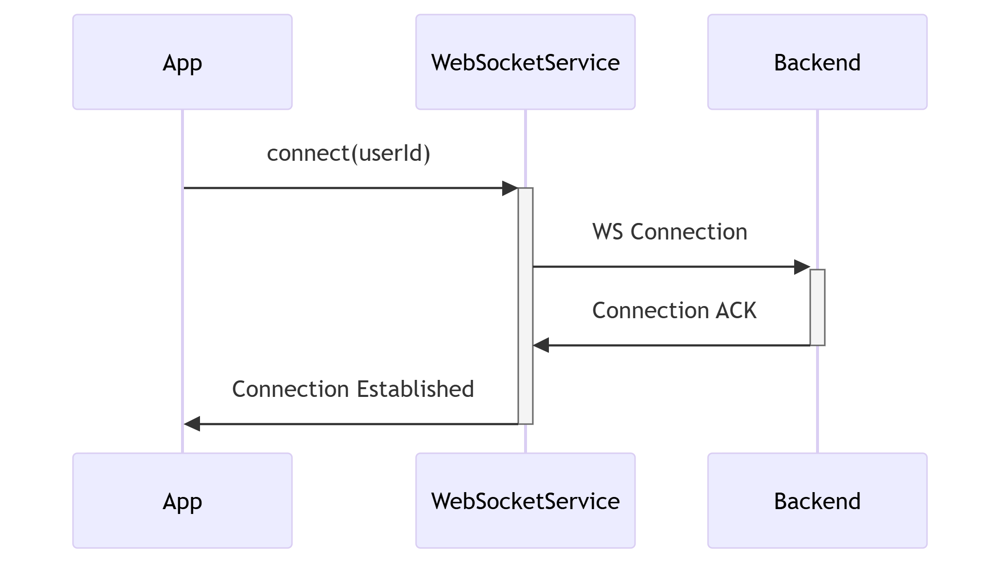
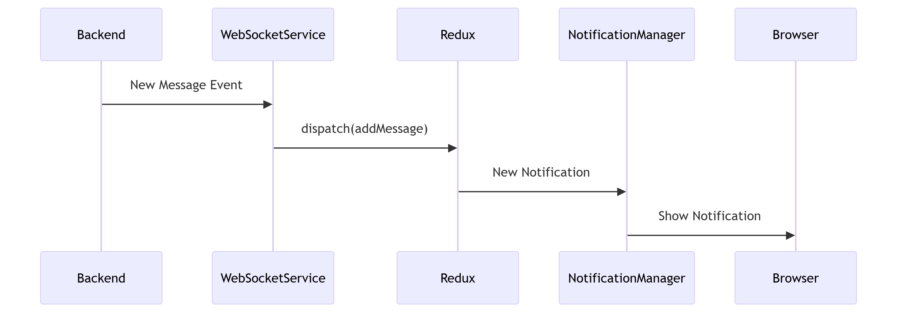
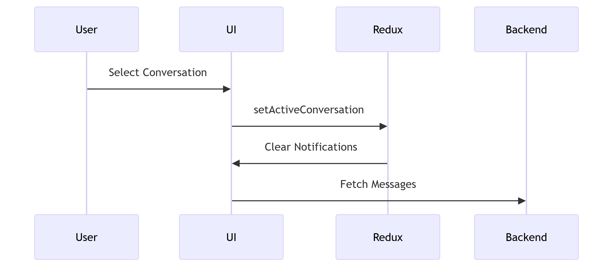

# WebSocket Implementation for Chat and Notifications

# 1. Global WebSocket Service (Enhanced)
```typescript
// src/lib/websocketService.ts
import { store } from '@/lib/redux/store';
import { addNotification, addMessage } from '@/lib/redux/slices/chatSlice';

class WebSocketManager {
  private static instance: WebSocketManager;
  private socket: WebSocket | null = null;
  private subscriptions: Map<string, (data: any) => void> = new Map();

  private constructor() {}

  public static getInstance(): WebSocketManager {
    if (!WebSocketManager.instance) {
      WebSocketManager.instance = new WebSocketManager();
    }
    return WebSocketManager.instance;
  }

  public connect(userId: string) {
    if (this.socket) return;

    const wsProtocol = window.location.protocol === "https:" ? "wss" : "ws";
    const wsUrl = `${wsProtocol}://127.0.0.1:8000/ws/notifications/?user_id=${userId}`;

    this.socket = new WebSocket(wsUrl);

    this.socket.onmessage = (event) => {
      const data = JSON.parse(event.data);
      this.handleEvent(data);
    };

    this.socket.onclose = () => {
      setTimeout(() => this.connect(userId), 3000);
    };
  }

  private handleEvent(data: any) {
    switch (data.event_type) {
      case 'new_message':
        store.dispatch(addMessage(data));
        this.handleMessageNotification(data);
        break;
      
      case 'new_conversation':
      case 'system_alert':
        store.dispatch(addNotification(data));
        this.showBrowserNotification(data);
        break;
    }
  }

  private handleMessageNotification(message: any) {
    const state = store.getState();
    const isActiveConversation = state.chat.activeConversationId === message.conversation_id;
    
    if (!isActiveConversation) {
      store.dispatch(addNotification({
        id: `msg-${message.id}-${Date.now()}`,
        type: 'new_message',
        title: 'New Message',
        content: message.text,
        meta: {
          conversationId: message.conversation_id,
          sender: message.sender
        },
        timestamp: new Date().toISOString(),
        read: false
      }));
      
      this.showBrowserNotification(message);
    }
  }

  private showBrowserNotification(data: any) {
    if ('Notification' in window && Notification.permission === 'granted') {
      const title = data.event_type === 'new_message' 
        ? `New message from ${data.sender}`
        : data.title;
      
      new Notification(title, {
        body: data.content || data.text,
        icon: '/notification-icon.png',
        data: { meta: data.meta }
      });
    }
  }

  public subscribe(eventType: string, callback: (data: any) => void) {
    this.subscriptions.set(eventType, callback);
  }
}

export const socketManager = WebSocketManager.getInstance();
```
# 2. Enhanced Redux Slice
```typescript
// src/lib/redux/slices/chatSlice.ts
import { createSlice, PayloadAction } from '@reduxjs/toolkit';

interface Notification {
  id: string;
  type: string;
  title: string;
  content: string;
  meta: Record<string, any>;
  timestamp: string;
  read: boolean;
}

interface ChatState {
  activeConversationId: string | null;
  messages: Record<string, Message[]>;
  notifications: Notification[];
}

const initialState: ChatState = {
  activeConversationId: null,
  messages: {},
  notifications: []
};

const chatSlice = createSlice({
  name: 'chat',
  initialState,
  reducers: {
    setActiveConversation: (state, action: PayloadAction<string>) => {
      state.activeConversationId = action.payload;
    },
    addMessage: (state, action: PayloadAction<Message>) => {
      const msg = action.payload;
      const conversationId = msg.conversation_id;
      
      if (!state.messages[conversationId]) {
        state.messages[conversationId] = [];
      }
      
      state.messages[conversationId].push(msg);
    },
    addNotification: (state, action: PayloadAction<Notification>) => {
      state.notifications.unshift(action.payload);
    },
    markNotificationRead: (state, action: PayloadAction<string>) => {
      const notification = state.notifications.find(n => n.id === action.payload);
      if (notification) notification.read = true;
    },
    clearConversationNotifications: (state, action: PayloadAction<string>) => {
      state.notifications = state.notifications.filter(
        n => !(n.type === 'new_message' && n.meta.conversationId === action.payload)
      );
    }
  }
});

export const { 
  setActiveConversation,
  addMessage,
  addNotification,
  markNotificationRead,
  clearConversationNotifications
} = chatSlice.actions;

export default chatSlice.reducer;
```
# 3. updated conversation hook
```typescript
// src/hooks/useConversationMessages.ts
import { useEffect, useRef } from "react";
import { useGetMessagesQuery } from "@/lib/redux/services/conversationApi";
import { useAppDispatch, useAppSelector } from "@/lib/redux/store";
import { socketManager } from "@/lib/websocketService";

export default function useConversationMessages(conversationId?: string) {
  const dispatch = useAppDispatch();
  const activeConversationId = useAppSelector(state => state.chat.activeConversationId);
  const storedMessages = useAppSelector(state => 
    conversationId ? state.chat.messages[conversationId] || [] : []
  );

  // Fetch initial messages
  const { data: initialMessages, isLoading, isError } = useGetMessagesQuery(
    conversationId!, { skip: !conversationId }
  );

  // Combine initial fetch + real-time messages
  const messages = initialMessages 
    ? [...initialMessages, ...storedMessages.filter(m => 
        !initialMessages.some(im => im.id === m.id)
      )] 
    : storedMessages;

  // Set active conversation and clear notifications
  useEffect(() => {
    if (conversationId) {
      dispatch(setActiveConversation(conversationId));
      dispatch(clearConversationNotifications(conversationId));
    }
    return () => {
      dispatch(setActiveConversation(null));
    };
  }, [conversationId, dispatch]);

  // Setup WebSocket listeners
  useEffect(() => {
    if (!conversationId) return;

    const messageHandler = (data: Message) => {
      if (data.conversation_id === conversationId) {
        dispatch(addMessage(data));
      }
    };

    socketManager.subscribe('new_message', messageHandler);

    return () => {
      socketManager.subscribe('new_message', () => {});
    };
  }, [conversationId, dispatch]);

  return {
    isLoading,
    isError,
    messages,
    activeConversationId
  };
}
```
# 4. Notification Center Component
```tsx
// src/components/NotificationCenter.tsx
import { useEffect } from 'react';
import { useAppDispatch, useAppSelector } from '@/lib/redux/store';
import { markNotificationRead } from '@/lib/redux/slices/chatSlice';

export default function NotificationCenter() {
  const dispatch = useAppDispatch();
  const notifications = useAppSelector(state => state.chat.notifications);
  const unreadNotifications = notifications.filter(n => !n.read);

  // Request notification permission
  useEffect(() => {
    if ('Notification' in window && Notification.permission !== 'denied') {
      Notification.requestPermission();
    }
  }, []);

  // Handle click notifications
  const handleNotificationClick = (notification: Notification) => {
    dispatch(markNotificationRead(notification.id));
    
    if (notification.meta?.conversationId) {
      // Navigate to conversation
    }
  };

  return (
    <div className="notification-center">
      {unreadNotifications.map(notification => (
        <div 
          key={notification.id}
          className="notification-item"
          onClick={() => handleNotificationClick(notification)}
        >
          <div className="notification-badge"></div>
          <h4>{notification.title}</h4>
          <p>{notification.content}</p>
          <time>{new Date(notification.timestamp).toLocaleTimeString()}</time>
        </div>
      ))}
    </div>
  );
}
```
# App Initialization
```tsx
// src/app/layout.tsx
import { useEffect } from 'react';
import { socketManager } from '@/lib/websocketService';
import { useGetCurrentUserQuery } from '@/lib/redux/services/authApi';

export default function RootLayout() {
  const { data: user } = useGetCurrentUserQuery();
  
  useEffect(() => {
    if (user?.id) {
      socketManager.connect(user.id.toString());
    }
    
    return () => {
      socketManager.disconnect();
    };
  }, [user]);

  return (
    <>
      <NotificationCenter />
      {/* ... rest of layout */}
    </>
  );
}
```

# Key Improvements

## Unified Event Handling

- Single WebSocket connection for all real-time events  
- Centralized event processing with proper typing  
- Automatic reconnection  

## Smart Notifications

- Automatic suppression for active conversations  
- Metadata linking notifications to conversations  
- Browser notification integration  
- Visual notification badges  

## Optimized State Management

- Dedicated chat slice for messages and notifications  
- Efficient message merging in hooks  
- Automatic notification clearing when conversations open  

## Performance Enhancements

- Selective subscription to conversation events  
- Memoized message combining  
- Deduplication of messages  
- Efficient notification filtering  

## Scalable Architecture

- Support for multiple event types (messages, alerts, conversations)  
- Decoupled notification system  
- Metadata-driven navigation  

# Backend Recommendations

1. Implement user-specific channels  
```python
# Django Channels Example
class NotificationConsumer(AsyncWebsocketConsumer):
    async def connect(self):
        user_id = self.scope['url_route']['kwargs']['user_id']
        await self.channel_layer.group_add(
            f"user_{user_id}",
            self.channel_name
        )
        await self.accept()

    async def new_message(self, event):
        await self.send(text_data=json.dumps({
            'event_type': 'new_message',
            ...event['message']
        }))
```
2. message format
```json
{
  "event_type": "new_message",
  "id": "msg_12345",
  "conversation_id": "conv_67890",
  "text": "Hello there!",
  "sender": "customer",
  "timestamp": "2023-07-15T10:30:00Z",
  "meta": {
    "customer_name": "John Doe"
  }
}
```

## Current Implementation Analysis

```typescript
// Current useConversationMessages.ts
import { useGetMessagesQuery, useSendMessageMutation } from "@/lib/redux/services/conversationApi";
import { Message } from "@/types/conversation";
import { useEffect, useRef, useState } from "react";

export default function useConversationMessages(conversationId?: string) {
    // ... existing implementation ...
}
```
## Current Limitations:

1. WebSocket only opens per conversation

2. No notifications for messages in other conversations

3. No global notification system

4. Duplicate connection potential

5. Proposed Solution Architecture

# Proposed Solution Architecture
## 1. WebSocket Service (Singleton)

```typescript
// websocketService.ts
class WebSocketManager {
  private static instance: WebSocketManager;
  private socket: WebSocket | null = null;

  public static getInstance(): WebSocketManager {
    if (!WebSocketManager.instance) {
      WebSocketManager.instance = new WebSocketManager();
    }
    return WebSocketManager.instance;
  }

  public connect(userId: string) {
    const wsProtocol = window.location.protocol === "https:" ? "wss" : "ws";
    const wsUrl = `${wsProtocol}://127.0.0.1:8000/ws/notifications/?user_id=${userId}`;
    
    this.socket = new WebSocket(wsUrl);
    
    this.socket.onmessage = (event) => {
      const data = JSON.parse(event.data);
      this.handleEvent(data);
    };
  }

  private handleEvent(data: any) {
    switch (data.event_type) {
      case 'new_message':
        store.dispatch(addMessage(data));
        if (!isActiveConversation(data.conversation_id)) {
          this.createNotification(data);
        }
        break;
    }
  }
}
```

## 2. Redux State Structure
```typescript
// chatSlice.ts
interface ChatState {
  activeConversationId: string | null;
  messages: Record<string, Message[]>;
  notifications: Notification[];
}

const initialState: ChatState = {
  activeConversationId: null,
  messages: {},
  notifications: []
};
```
## 3. Enhanced Conversation Hook
```typescript
// useConversationMessages.ts
export default function useConversationMessages(conversationId?: string) {
  const dispatch = useAppDispatch();
  const messages = useAppSelector(state => 
    conversationId ? state.chat.messages[conversationId] || [] : []
  );

  useEffect(() => {
    if (conversationId) {
      dispatch(setActiveConversation(conversationId));
      dispatch(clearConversationNotifications(conversationId));
    }
  }, [conversationId]);
}
```
## 4. Notification System Components
```typescript
// NotificationManager.tsx
export default function NotificationManager() {
  const unreadNotifications = useAppSelector(state => 
    state.chat.notifications.filter(n => !n.read)
  );

  useEffect(() => {
    unreadNotifications.forEach(notification => {
      new Notification(notification.title, {
        body: notification.content,
        data: notification.meta
      });
    });
  }, [unreadNotifications]);
}
```
## Implementation Flow
### 1. Initialization:


### 2. New Message Flow:


### 3. Conversation Switching


# Backend Requirements
## WebSocket Endpoint
- URL: wss://yourserver.com/ws/notifications/?user_id={id}

- Authentication: JWT in query params

- Supported Events:
```json
{
  "event_type": "new_message",
  "message": {
    "id": "msg_123",
    "conversation_id": "conv_456",
    "text": "Hello!",
    "sender": "customer"
  }
}
```

## REST API Endpoints
- **GET /api/conversations/{id}/messages** - Get conversation history

- **POST /api/conversations/{id}/messages** - Send new message

- **GET /api/notifications** - Get notification history

# Migration Steps
**Phase 1: Global WebSocket**

- Implement singleton WebSocket service

- Add Redux state for notifications

- Modify conversation hook to use global socket

**Phase 2: Notification System**

- Create notification manager component

- Implement browser notification API

- Add notification center UI

**Phase 3: Optimization**

- Add message deduplication

- Implement connection health monitoring

- Add offline support with message queue

# Error Handling
```typescript
// WebSocket error handling
socket.onerror = (error) => {
  console.error('WebSocket error:', error);
  store.dispatch(setConnectionStatus('error'));
  scheduleReconnect();
};

// Notification fallback
if (!('Notification' in window)) {
  console.warn('Browser notifications not supported');
  // Fallback to in-app notifications
}
```

# Performance Considerations
1. Message Batching:
    - Batch incoming messages during high load
    - Debounce UI updates

2. Selective Rendering:
```tsx
const messages = useSelector(state => 
  selectMessagesForConversation(state, conversationId)
);
```
3. Connection Management:

    - Close WS when app is hidden (Page Visibility API)
    - Reconnect when app becomes visible

# Testing Strategy

## Unit Tests

- WebSocket service methods  
- Redux reducers  
- Notification formatting  

## Integration Tests

- Message flow from backend to UI  
- Notification triggering  
- Conversation switching  

## E2E Tests

- Full chat scenario  
- Multiple device sync  
- Offline recovery  
